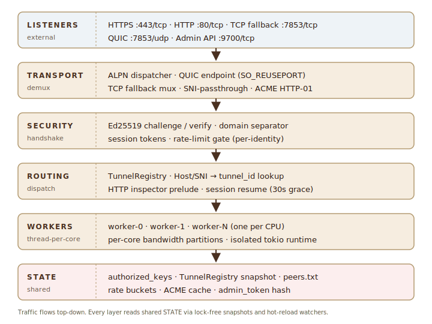

<p align="center">
  
</p>

<p align="center">
  <a href="https://github.com/krottunnel/krot/actions/workflows/ci.yml"></a>
  <a href="https://github.com/krottunnel/krot/releases/latest"></a>
  <a href="./LICENSE-MIT"></a>
  
</p>

<p align="center">
  <b>English</b> · <a href="./README.ru.md">Русский</a>
</p>

# krot

**Self-hosted ngrok in Rust. Zero-knowledge, thread-per-core, passwordless.**

`krot` is an open-source tunneling service: your own VPS, one Docker
container, no subscription and no trust in a third-party relay. HTTPS
traffic passes through the server encrypted end-to-end to the tunnel
client, authorization keys are SSH-style (`authorized_keys`), and the
apex-domain certificate is obtained and renewed by the server itself
via ACME.

Written in stable Rust on top of `tokio`, `quinn` (QUIC) and `rustls`.
A single binary (~7 MB, release + LTO + strip), Docker image ~85 MB on
debian-slim.

<details>
<summary><b>Table of contents</b></summary>

- [What's inside](#whats-inside)
- [Installation](#installation)
- [Quick start](#quick-start)
- [CLI reference](#cli-reference)
- [Admin API](#admin-api)
- [Architecture](#architecture)
- [Federated relays](#federated-relays)
- [Security](#security)
- [Known limitations](#known-limitations)
- [Development](#development)
- [Contributing](#contributing)
- [Reporting security issues](#reporting-security-issues)
- [License](#license)

</details>

---

## What's inside

| | |
|---|---|
| **QUIC + TCP fallback** | Primary transport is QUIC over UDP. Clients behind corporate NATs that block UDP transparently fall back to TLS 1.3 over TCP with a mini-mux. Same port, distinguished by ALPN. |
| **Zero-knowledge apex TLS** | The server terminates TLS **only** on the apex (`krot.example`). Connections to `alice.krot.example` go via SNI-passthrough — the server sees only an encrypted stream. Subdomain private keys never touch the server. |
| **Thread-per-core** | Every core gets an isolated `tokio` current-thread runtime and its own QUIC endpoint via `SO_REUSEPORT`. Rate limits are partitioned per-core — each worker has its own bandwidth bucket, the aggregate cap is respected. |
| **Passwordless Ed25519 bootstrap** | The client generates an Ed25519 key and knocks with a one-shot admin token (32 bytes of entropy, BLAKE3-hashed on disk, 10-minute TTL). The server appends the pubkey to `authorized_keys`. |
| **ACME auto-renewal** | Built-in HTTP-01 responder on port 80. Let's Encrypt certificate for the apex, renewal 30 days before expiry. Cache in `data_dir/acme/`, mode `0700`. |
| **Session resume** | Client crashed? On reconnect it re-attaches to the same `public_url` within a 30-second grace period. Works **across transports** — you can drop a QUIC session and restore it over the TCP fallback. |
| **Rate limiting** | Per-identity token-bucket via `governor` plus a period quota. Fully partitioned per-core, the aggregate cap is respected. When the quota is exhausted the server sends the client `retry_after_ms`. |
| **Passive HTTP inspector** | `--inspect` enables a local admin UI on `localhost:4040` — method, path, status, and duration of every request. |
| **Login-page auth** | `krot http --auth user:pass` serves a styled sign-in page with the krot brand mark; a successful login installs a session cookie (`HttpOnly; SameSite=Lax`, 8h rolling TTL). For machines — `--api-key SECRET` (`X-API-Key` / `Authorization: Bearer`). File/env variants for non-dev use. Constant-time compare, no secrets in logs. |
| **Admin API** | `/admin/v1/{tunnels,keys,metrics}` HTTP endpoint on `127.0.0.1:9700`. Bearer-token auth, Prometheus metrics, key revocation in under 1 second. |
| **Federated relays** | Multi-relay setup: `federation=peer1,peer2` in `authorized_keys`. The client publishes one tunnel on several relays, DNS/CDN handles failover. |
| **Hot-reload of authorization** | Key removed from `authorized_keys`? Active sessions get a revoke notification within <1s via the `notify` watcher. Same mechanism for the peer list. |
| **Graceful shutdown** | `Ctrl+C` sends a clean `ServerBye` to every open session, waits for ACKs, then closes the endpoint. Deadline 5 seconds. |

---

## Installation

Four ways to get `krot-server` and `krot-client` binaries.

### Prebuilt binaries (recommended)

Download from the [latest release](https://github.com/krottunnel/krot/releases/latest):

| Platform | Archive |
|---|---|
| Linux · x86_64 | `krot-vX.Y.Z-x86_64-unknown-linux-musl.tar.gz` |
| Linux · ARM64 | `krot-vX.Y.Z-aarch64-unknown-linux-musl.tar.gz` |
| macOS · Apple Silicon | `krot-vX.Y.Z-aarch64-apple-darwin.tar.gz` |
| Windows · 64-bit | `krot-vX.Y.Z-x86_64-pc-windows-msvc.zip` |
| Windows · 32-bit | `krot-vX.Y.Z-i686-pc-windows-msvc.zip` |

Each archive contains `krot-server`, `krot` (the client CLI), `LICENSE-*`, `README.md`. Verify the accompanying `.sha256`, extract, and move the binaries into your `PATH`. Intel Mac users: run the `aarch64-apple-darwin` build under Rosetta 2, or use `cargo install --git` below.

### With cargo

Requires a stable Rust toolchain (get one from [rustup.rs](https://rustup.rs)):

```bash
cargo install --git https://github.com/krottunnel/krot krot-server krot-client
```

Binaries land in `~/.cargo/bin/` on unix or `%USERPROFILE%\.cargo\bin\` on Windows.

### With Docker (server only)

```bash
docker pull krottunnel/krot-server:latest
```

Multi-arch image (`linux/amd64`, `linux/arm64`).

### From source

```bash
git clone https://github.com/krottunnel/krot
cd krot
cargo build --release --workspace
# → target/release/krot-server, target/release/krot-client
```

---

## Quick start

Prerequisites: a VPS with a public IP, your own domain, wildcard DNS
`*.krot.example → <VPS IP>`, ports 80/443/7853 open.

### 1. Server

```bash
# prebuilt image from Docker Hub — recommended:
docker pull krottunnel/krot-server:latest
# or build locally:
# docker build -t krottunnel/krot-server:dev .

docker run -d --name krot \
  -p 7853:7853/udp \
  -p 7853:7853/tcp \
  -p 80:80/tcp \
  -p 443:443/tcp \
  -v krot-data:/var/lib/krot \
  -v krot-config:/etc/krot \
  krottunnel/krot-server:latest \
  --domain krot.example \
  --acme-contact mailto:admin@krot.example \
  --acme-production \
  --tcp-fallback-bind 0.0.0.0:7853

# the server prints a one-shot admin token:
docker logs krot | grep KROT_ADMIN_TOKEN
# KROT_ADMIN_TOKEN=R54VHZ9FD0JJ44GPDZFEJZ7DV8WFB77JHYHVPFF64BF677X7WX70
```

> **Root/privileges.** Defaults `--http-bind 0.0.0.0:80` and
> `--https-bind 0.0.0.0:443` are privileged ports. The Docker container
> above runs via `-p 80:80/tcp`, where Docker handles the mapping.
> Running **without Docker** requires either `sudo` or `setcap
> 'cap_net_bind_service=+ep' target/release/krot-server`. For local
> development, remap to unprivileged ports: `--http-bind 127.0.0.1:8080
> --https-bind 127.0.0.1:8443`.

### 2. Client

```bash
krot init --server krot.example --admin-token R54VHZ9FD0JJ44...
# → enrolled at krot.example:7853
```

### 3. Publish a local service

```bash
krot http 3000 --name alice --inspect
# → https://alice.krot.example
# → inspector: http://127.0.0.1:4040
```

Done. External requests to `https://alice.krot.example` flow through
the server, TLS-encrypted end-to-end to your client.

---

## CLI reference

### `krot-server`

| Flag | Default | What it does |
|---|---|---|
| `--domain <apex>` | — | Enables DomainMode. Without it — IpMode (TCP tunnels only, self-signed cert with pinned fingerprint). |
| `--acme-contact mailto:...` | — | Obtain the apex certificate via ACME (Let's Encrypt **staging** by default). |
| `--acme-production` | off | Switch to LE production. |
| `--tls-cert / --tls-key` | — | Alternative to ACME — bring your own PEM certificate. |
| `--bind` | `0.0.0.0:7853` | UDP address of the QUIC endpoint. |
| `--tcp-fallback-bind <addr>` | disabled | TCP+TLS listener for clients with UDP blocked. |
| `--http-bind` / `--https-bind` | `0.0.0.0:80` / `:443` | Addresses for the 80/443 routers. |
| `--tcp-port-pool <lo-hi>` | `10000-19999` | Port pool for TCP tunnels. |
| `--cores N` | `available_parallelism()` | Number of worker threads. The `bw=` cap is partitioned per-core. |
| `--data-dir` | `/var/lib/krot` | Persistent state (identity cert, ACME cache, admin_token hash). |
| `--authorized-keys` | `/etc/krot/authorized_keys` | SSH-style file of authorized keys. Hot-reload. |
| `--peer-list` | `/etc/krot/peers.txt` | Static list of federated relays (one apex per line). Hot-reload. |
| `--admin-bind` | `127.0.0.1:9700` | Structured admin API. Empty value disables it. |
| `--issue-admin-token` | off | Issue a new admin token even if `authorized_keys` is non-empty. |

### `krot` (client)

| Subcommand | What it does |
|---|---|
| `krot init --server HOST --admin-token TOKEN [--fingerprint sha256:HEX]` | Generate identity, enroll the public key. IpMode uses the pinned fingerprint; DomainMode uses a real CA. |
| `krot tcp <port>` | Publish a TCP service (`ssh`, DB, minecraft, anything) as `tcp://<host>:<port>`. |
| `krot http <port> [flags]` | Publish an HTTP service as `https://<label>.<apex>`. See auth flags below. |

**Client auth flags** (only for `krot http`, apply on the plain-HTTP
branch; HTTPS-passthrough remains opaque):

| Flag | Description |
|---|---|
| `--auth <user:pass>` | Styled login page + session cookie (`HttpOnly; SameSite=Lax`, 8h rolling TTL). Special paths `/__krot/login` and `/__krot/logout` are intercepted by the client. Dev only — credentials show up in `ps`. |
| `--auth-env <VAR>` | Same, but reads `user:pass` from an environment variable. |
| `--auth-file <path>` | Same, but reads `user:pass` from a file (single line, trims trailing newlines). |
| `--api-key <SECRET>` / `--api-key-env` / `--api-key-file` | Header-based auth for machines: `X-API-Key: <key>` or `Authorization: Bearer <key>`. 403 on mismatch. |
| `--auth-realm <string>` | Internal string, shown only in diagnostics of the API-key branch. Default `"KROT Protected Tunnel"`. |
| `--name <label>` | Requested subdomain label (default: random). |
| `--inspect` / `--inspect-bind <addr>` | Local admin UI with request history. |

### Automatic fallback

The client tries QUIC first, and on a transport-level failure retries
via TCP fallback. Transparent to the user.

---

## Admin API

Structured HTTP endpoint on `127.0.0.1:9700` for the operator.
Bearer-token auth.

```bash
# Exchange the enrollment admin_token for a session_token (single-use):
curl -s http://127.0.0.1:9700/admin/v1/session \
  -H 'Content-Type: application/json' \
  -d '{"admin_token":"R54VHZ9FD0JJ44..."}'
# → {"session_token":"XXXX","expires_at_unix":1735000000}

TOKEN=XXXX

# List tunnels
curl -H "Authorization: Bearer $TOKEN" http://127.0.0.1:9700/admin/v1/tunnels
# → [{"tunnel_id":1,"kind":"http","label":"alice","state":"live","inspect":false,...}]

# List authorized keys
curl -H "Authorization: Bearer $TOKEN" http://127.0.0.1:9700/admin/v1/keys

# Add a key (append to authorized_keys)
curl -X POST -H "Authorization: Bearer $TOKEN" \
  -H 'Content-Type: application/json' \
  -d '{"line":"ed25519 AAAA... subdomain=bob conns=3"}' \
  http://127.0.0.1:9700/admin/v1/keys

# Revoke: within <1s hot-reload kills active sessions of this key
curl -X DELETE -H "Authorization: Bearer $TOKEN" \
  http://127.0.0.1:9700/admin/v1/keys/AAAA...=

# Prometheus metrics (~30 counters + gauges)
curl -H "Authorization: Bearer $TOKEN" http://127.0.0.1:9700/admin/v1/metrics
# → krot_uptime_seconds 42
# → krot_build_info{version="0.1.0"} 1
# → krot_tunnels_total 3
# → krot_handshake_auth_ok_total 12
# → krot_session_bye_total 8
# → krot_resume_reattached_total 3
# → krot_rate_limit_quota_exceeded_total 4
# → krot_transport_quic_accepted_total 20
# → krot_transport_tcp_fallback_accepted_total 5
# → krot_bytes_period_used{pubkey="AAAA..."} 1234567
```

**JSON logging** (for log-aggregation — Loki, Elastic, etc.):

```bash
KROT_LOG_FORMAT=json RUST_LOG=info krot-server ...
# → {"timestamp":"...","level":"INFO","fields":{"message":"..."},...}
```

A publicly-exposed admin API MUST sit behind a TLS reverse-proxy
(nginx / caddy). The loopback default is safe.

---

## Architecture

<p align="center">
  
</p>

Workspace crates:

| Crate | Role |
|---|---|
| `krot-proto` | Wire types, framing, Ed25519 challenge-response, inspector prelude. |
| `krot-transport` | Connection/stream wrappers with two backends: QUIC and mux-over-TCP. ALPN + keep-alive. |
| `krot-server` | Relay: registry, auth handshake, ACME, SNI/Host routers, thread-per-core, admin API, peer registry, rate limiting. |
| `krot-client` | CLI + enroll flow + inspector + auto-fallback + login-page/API-key auth. |

---

## Federated relays

One identity → multiple relays at once. Live URLs work from all of them.

**Step 1** — set up the peer list on each relay:

```bash
# on relay-1 (krot.us.example):
cat > /etc/krot/peers.txt <<EOF
krot.eu.example
krot.asia.example
EOF
# hot-reload picks it up immediately
```

**Step 2** — `authorized_keys` with `federation=`:

```
ed25519 AAAA... subdomain=alice federation=krot.eu.example,krot.asia.example
```

**Step 3** — the client polls the peer list and publishes on the
allowed relays:

```bash
krot http 3000 --name alice --federate
# → https://alice.krot.us.example
# → https://alice.krot.eu.example
# → https://alice.krot.asia.example
```

**Cross-relay collision detection.** On `label` registration, the
server consults neighboring relays:

- If a peer already has this `label` from the **same** identity →
  additional destination (allow, log).
- If from a **different** identity → reject with `LABEL_UNAVAILABLE`.
- Peer unreachable → fail-open.

---

## Security

| Threat | Mitigation |
|---|---|
| MITM client↔server | IpMode: SPKI SHA-256 pin via `--fingerprint sha256:...`. DomainMode: public CA. |
| Subdomain private-key leak | The server does **not** store them. The client terminates TLS itself or forwards the encrypted stream. |
| Identity theft | Identity in `~/.krot/identity` mode `0600`. Rotation = generate a new one, remove the old line from `authorized_keys`. Hot-reload kills active sessions within <1s. |
| Replay of challenge signature | Domain separator prefixed to every Ed25519 signature. |
| Admin-token bruteforce | 32 bytes of entropy + BLAKE3 constant-time compare + single-use + 10-minute TTL. |
| Login-page bruteforce | Rate-limiting the brute-force is on the operator (reverse-proxy). Wrong/missing credentials return an identical page with a generic message. Session cookie = 32 bytes of entropy from `OsRng`, in-memory store. |
| DoS via spoofed UDP | QUIC session tickets + per-identity bandwidth limits. Unknown identities do not take space in the rate table. |
| Frame parser panic | Bounded allocations (64 KiB frames, 8 KiB HTTP, 256 KiB mux). Property tests + fuzz targets. |
| Cross-relay label spoofing | Collision detection consults peers before allocation. Same-identity → additional destination, different → reject. |

---

## Known limitations

- **Continuous soak testing.** There's `scripts/soak/` for a manual
  two-VDS run; automated soak in CI is not wired up yet.
- **DomainMode multi-level subdomains** (`a.b.krot.example`) fail
  validation — only one level is supported.
- **IPv6-only VPS** should work but is not tested in CI.

---

## Development

```bash
# All crates, all tests.
cargo test --workspace

# Style / lint checks (matches CI).
cargo fmt --all -- --check
cargo clippy --workspace --all-targets -- -D warnings

# Deep proptest sweep (default is 256 cases, bump manually):
PROPTEST_CASES=10000 cargo test --workspace

# Local server + client in two terminals:
cargo run -p krot-server -- \
    --data-dir /tmp/krot-server --authorized-keys /tmp/krot-server/authorized_keys \
    --peer-list /tmp/krot-server/peers.txt \
    --bind 127.0.0.1:7853 --tcp-port-pool 10000-10999 --cores 1 \
    --admin-bind 127.0.0.1:9700

# (grab KROT_ADMIN_TOKEN and KROT_SERVER_FINGERPRINT from stdout)

cargo run -p krot-client -- \
    --data-dir /tmp/krot-client init \
    --server 127.0.0.1:7853 --admin-token XXX --fingerprint sha256:YYY

cargo run -p krot-client -- --data-dir /tmp/krot-client tcp 3000
```

Changelog: [`CHANGELOG.md`](./CHANGELOG.md).

CI: [.github/workflows/ci.yml](./.github/workflows/ci.yml) —
fmt/clippy/test on Linux+macOS, MSRV pin, `cargo audit`, 60s fuzz
smoke per target.

---

## Contributing

Bug reports, feature requests, and patches are welcome.

Before opening a pull request:

1. Run `just ci` (fmt + clippy + tests). This must be green.
2. For user-visible changes, add a line to `CHANGELOG.md` under a new version heading.
3. Keep commits focused — one logical change per commit.

New to Rust or to this codebase? The `Development` section above walks through running a local server + client pair; that's the fastest way to get oriented.

---

## Reporting security issues

Please **do not** open a public GitHub issue for security vulnerabilities.

Use GitHub's [private security advisory form](https://github.com/krottunnel/krot/security/advisories/new) to report privately. Expect a first reply within 72 hours.

Coordinated disclosure timeline: 90 days from the initial report unless mutually extended.

---

## License

Licensed under either of

- **MIT** license ([LICENSE-MIT](./LICENSE-MIT))
- **Apache License, Version 2.0** ([LICENSE-APACHE](./LICENSE-APACHE))

at your option.

SPDX-License-Identifier: `MIT OR Apache-2.0`

Unless you explicitly state otherwise, any contribution intentionally submitted for inclusion in this work by you, as defined in the Apache-2.0 license, shall be dual licensed as above, without any additional terms or conditions.
